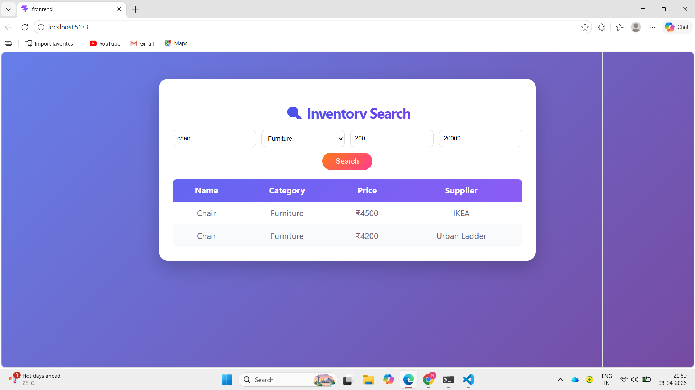
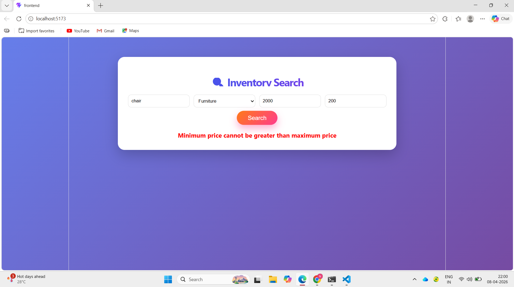
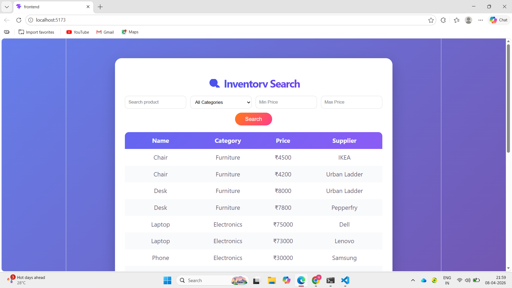

# Inventory Search API + UI
## 🌐 Hosted Links

* Frontend: https://inventory-search-project-tp8v.vercel.app/
* Backend: https://inventory-search-project-9cfg.onrender.com

Part B (Inventory Database System):
Backend API: https://inventory-database-project-5.onrender.com/
GitHub: https://github.com/Khadarbeesk/inventory-database-project


## 🚀 Tech Stack

* Frontend: React (Vite)
* Backend: Node.js, Express
* Styling: CSS
* Data Source: Static JSON

---

## 🔍 Features

* Search products by name (case-insensitive, partial match)
* Filter by category
* Filter by price range (minPrice, maxPrice)
* Combine multiple filters
* Handles edge cases:

  * Invalid price inputs
  * Invalid price range
  * No results found
* Responsive UI with loading state

---

## 🔍 Search Logic

The `/search` API processes requests by applying filters step-by-step on the inventory dataset:

1. The API starts with the complete list of products.
2. If `q` is provided, it filters products whose names contain the given keyword using a **case-insensitive partial match**.
3. If `category` is provided, it filters products that exactly match the given category (case-insensitive).
4. If `minPrice` is provided, it includes only products with price greater than or equal to that value.
5. If `maxPrice` is provided, it includes only products with price less than or equal to that value.

All filters are optional and can be combined. Only products satisfying **all provided conditions** are returned. If no filters are given, the API returns the full inventory list.

---

## ⚠ Edge Case Handling

* **Empty search query** → Returns all products
* **Invalid price values** → Returns HTTP 400 with an error message
* **Invalid price range (`minPrice > maxPrice`)** → Returns HTTP 400
* **No matching results** → Returns an empty array (`[]`), which is displayed in the UI as "No results found"

---

## 🔗 API Routing

* **Endpoint:** `GET /search`
* **Query Parameters:**

  * `q` → product name (optional)
  * `category` → product category (optional)
  * `minPrice` → minimum price (optional)
  * `maxPrice` → maximum price (optional)

Example:

```bash
GET /search?q=chair&category=Furniture&minPrice=4000&maxPrice=5000
```

This request returns all furniture products with "chair" in the name and price between 4000 and 5000.


---

## ⚡ Performance Improvement

For large datasets, performance can be improved by using a single-pass filtering approach or by storing data in a database with indexing for faster queries.

---

## 💻 How to Run Locally

### Backend

```bash
cd backend
npm install
node server.js
```

### Frontend

```bash
cd frontend
npm install
npm run dev
```
## 🔍 Search API

Base URL:
https://inventory-search-project-9cfg.onrender.com

### Examples:

Search by name:
https://inventory-search-project-9cfg.onrender.com/search?q=chair

Filter by category:
https://inventory-search-project-9cfg.onrender.com/search?category=Furniture

Filter by price:
https://inventory-search-project-9cfg.onrender.com/search?minPrice=4000&maxPrice=5000

Combined filters:
https://inventory-search-project-9cfg.onrender.com/search?q=chair&category=Furniture

## 📸 Screenshots
### Search Results


### Invalid Search Results


### Empty Search Results

